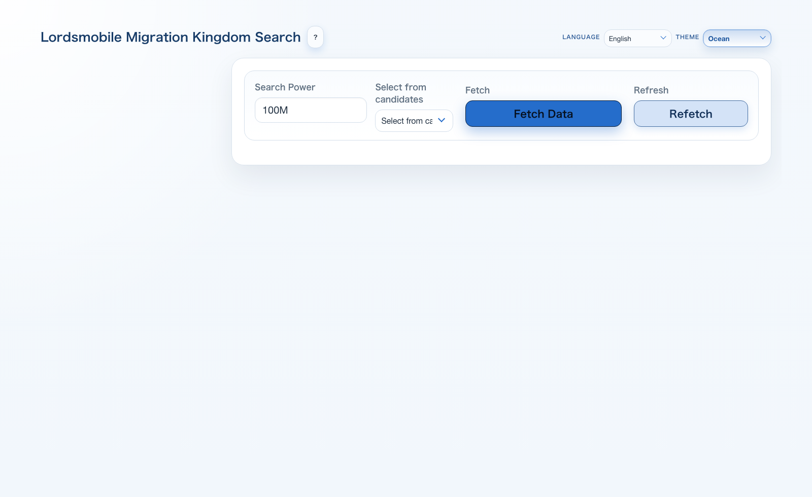
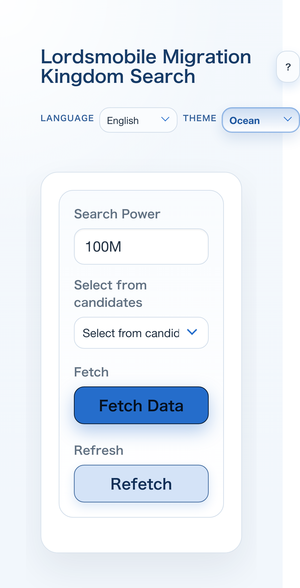

# getting_migration_tool

A browser-based tool for searching and filtering Lords Mobile migration target kingdoms.  
In the simplest workflow, you can download the repository and open `index.html` directly.

## What This Project Does

- Fetches migration target kingdoms by required power
- Filters by kingdom ID, kingdom status, required scrolls, and rank
- Supports paging and client-side table sorting
- Saves and reloads kingdom ID lists
- Extracts kingdom candidates from images with OCR
- Switches the UI across multiple languages, including Japanese and English

## Project Structure

- `index.html`
  - Entry point for the UI
- `app.js`
  - UI logic, API fetch, cache, filtering, and OCR helper
- `styles.css`
  - Theme and layout styling
- `server.js`
  - Local proxy for API access
- `locales/*.json`
  - Translation files for additional languages
- `assets/examples/ocr-reference-kingdoms.png`
  - Reference image for OCR
- `Specs.md`
  - Source of truth for current behavior and structure

## How to Start

### 1. If you only want to view the UI quickly

Open `index.html` directly in your browser.

- Double-click it in Finder on macOS
- Or drag and drop it into a browser window

This requires no setup.  
However, when the app runs via `file://`, browser restrictions may prevent stable API access or OCR asset loading.

### 2. If you want reliable API fetch and OCR

With Node.js installed, run this in the project root:

```bash
npm run start
```

Then open:

```text
http://127.0.0.1:6080
```

Available scripts:

- `npm run start`
- `npm run serve`
- `npm run start:6080`
- `npm run start:6000`

## How to Read the Screen

### Main Screen



- Top area
  - Language selector and theme selector
- Left search panel
  - Search text, kingdom status, scroll range, and page size controls
- Kingdom ID filter
  - Supports both range input like `1200-1250` and list input like `1201 1203 1207`
- Saved lists
  - Lets you store and reuse named kingdom ID filters
- OCR section
  - Extracts kingdom candidates from images and applies them to the filter
- Right result area
  - Shows fetch summary, result table, pagination, and cache usage

### Mobile View



- On narrow screens, the search panel collapses above the result area.
- The result table can be viewed with horizontal scrolling.

## Typical Usage Flow

1. Open the app, preferably at `http://127.0.0.1:6080`
2. Select the required power and click `Fetch Data`
3. Narrow the results with the filters on the left
4. Use sorting, pagination, saved lists, or OCR as needed

## Notes

- No frontend build step is required.
- External libraries are loaded from CDNs.
- API responses are cached locally.
- See [Specs.md](./Specs.md) for the full current specification.
