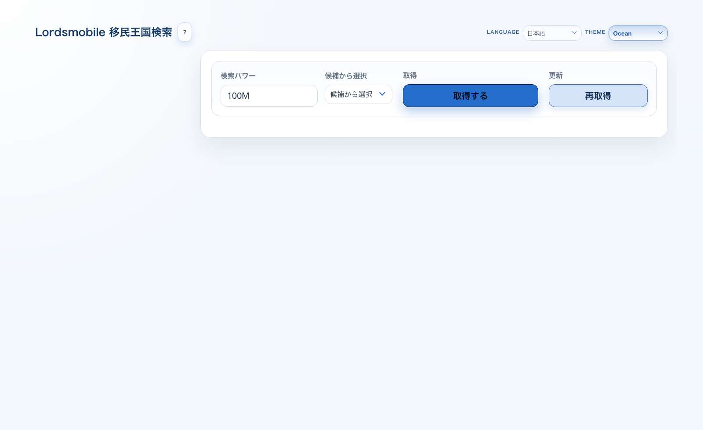
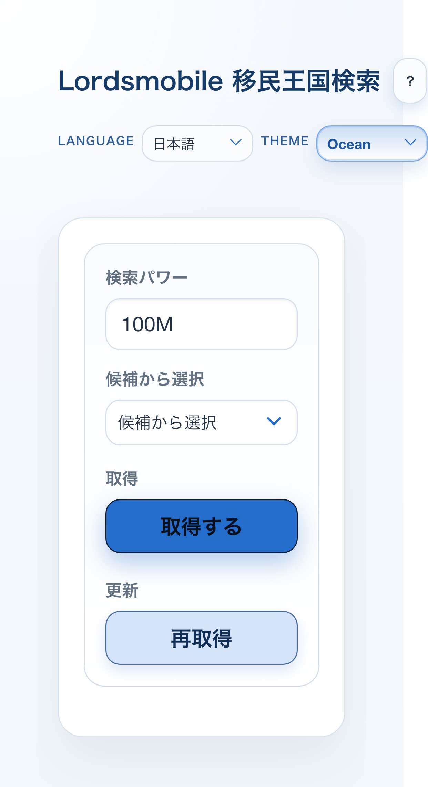

# getting_migration_tool

Lords Mobile の移民対象王国を検索・絞り込みするための、ブラウザ完結型ツールです。  
基本は Git からダウンロードして `index.html` を開くだけで画面を確認できます。

## このプロジェクトでできること

- 必要パワーごとの移民対象王国一覧を取得
- 王国番号、王国状態、必要巻物数、ランクで絞り込み
- ページングと列ソートで見やすく確認
- 王国番号リストの保存・再利用
- 画像 OCR から王国番号候補を抽出してフィルタへ反映
- 日本語 / 英語を含む多言語 UI 切り替え

## プロジェクト構成

- `index.html`
  - 画面のエントリーポイントです。
- `app.js`
  - 画面制御、API取得、キャッシュ、絞り込み、OCR 補助を担当します。
- `styles.css`
  - テーマとレイアウトを担当します。
- `server.js`
  - API 取得用のローカルプロキシです。
- `locales/*.json`
  - 追加言語用の翻訳データです。
- `assets/examples/ocr-reference-kingdoms.png`
  - OCR 用参考画像です。
- `Specs.md`
  - 現在の仕様の正本です。

## 起動方法

### 1. まず画面だけ確認したい場合

`index.html` をブラウザで直接開いてください。

- macOS Finder でダブルクリック
- またはブラウザにドラッグ&ドロップ

この方法はセットアップ不要です。  
ただし `file://` で開くため、ブラウザの制約で API 取得や OCR アセット読み込みが不安定になることがあります。

### 2. API 取得や OCR も安定して使いたい場合

Node.js が入っている環境で、プロジェクト直下で次を実行します。

```bash
npm run start
```

起動後に、ブラウザで次を開いてください。

```text
http://127.0.0.1:6080
```

利用できるスクリプト:

- `npm run start`
- `npm run serve`
- `npm run start:6080`
- `npm run start:6000`

## 画面の見方

### メイン画面



- 画面上部
  - 言語切り替えとテーマ切り替えがあります。
- 左側のフィルタメニュー
  - 絞り込み文字列、王国状態、必要巻物の範囲、表示件数を指定できます。
- 王国番号フィルタ
  - 範囲指定 `1200-1250` と、リスト指定 `1201 1203 1207` の両方に対応します。
- 保存済みリスト
  - よく使う王国番号条件を名前付きで保存し、あとで再利用できます。
- OCR セクション
  - 画像から王国番号候補を抽出し、フィルタへ反映できます。
- 右側の結果エリア
  - 取得結果の件数、テーブル、ページ送り、キャッシュ利用状況を確認できます。

### モバイル表示



- 画面幅が狭いとフィルタメニューは上部に折りたたみ表示されます。
- 結果テーブルは横スクロールで確認できます。

## 使い方の流れ

1. 必要なら `http://127.0.0.1:6080` で開く
2. 必要パワーを選んで `取得する`
3. 左側の条件で絞り込む
4. 必要に応じて列ソート、ページ送り、保存済みリスト、OCR を使う

## 補足

- フロントエンドはビルド不要です。
- 外部ライブラリは CDN 読み込みです。
- API 結果はローカルキャッシュされます。
- 詳細仕様は [Specs.md](./Specs.md) を参照してください。

## 参考・謝辞

- OCR 補助UIとブラウザ内でOCR候補を扱う体験の整理にあたって、[ogwata/ndlocr-lite-web-ai](https://github.com/ogwata/ndlocr-lite-web-ai) を参考にしています。
- このプロジェクトの OCR 機能は外部ライブラリに依存しており、それぞれの著作権およびライセンスは各ライブラリの条件に従います。
- 参考元の `ogwata/ndlocr-lite-web-ai` リポジトリでは、README 上でデュアルライセンス（CC BY 4.0 + MIT）が案内されています。

## 外部依存ライセンス

このプロジェクトでブラウザから読み込む主要な外部ライブラリと、確認時点のライセンス情報は次のとおりです。

| ライブラリ | 利用バージョン | 用途 | ライセンス | 参照先 |
| --- | --- | --- | --- | --- |
| Bulma | 1.0.4 | UI CSS フレームワーク | MIT | [jgthms/bulma](https://github.com/jgthms/bulma) |
| multiple-select | 2.3.0 | 複数選択UI | MIT | [wenzhixin/multiple-select](https://github.com/wenzhixin/multiple-select) |
| jQuery | 3.7.1 | DOM 操作とプラグイン基盤 | MIT | [jQuery License](https://jquery.com/license/) |
| Axios | 1.8.4 | HTTP クライアント | MIT | [axios/axios](https://github.com/axios/axios) |
| fuzzysort | 3.1.0 | クライアント側あいまい検索 | MIT | [farzher/fuzzysort](https://github.com/farzher/fuzzysort) |
| Tesseract.js | 6.x | OCR 実行 | Apache-2.0 | [naptha/tesseract.js](https://github.com/naptha/tesseract.js) |
| html2canvas | 1.4.1 | 表示中テーブルの画像出力 | MIT | [niklasvh/html2canvas](https://github.com/niklasvh/html2canvas) |

## ライセンス

このリポジトリは [MIT License](./LICENSE) のもとで公開しています。

- ただし、CDN 経由で読み込む外部ライブラリや OCR 関連ライブラリは、このリポジトリとは別のライセンスで提供されます。
- 利用時は、必要に応じて各依存ライブラリのライセンスも確認してください。
- 上の一覧は 2026-04-26 時点で、各公式サイト・公式リポジトリの表記をもとに確認したものです。
